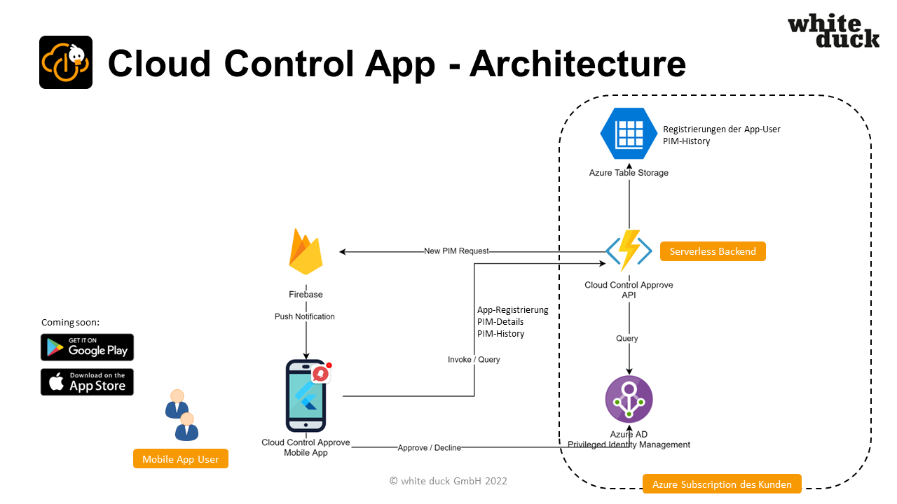

|     |   <h1> Welcome to the  **Cloud Control for Azure AD**   community and documentation </h1> |  
| ---- | ---- |

Thank you for your interest on our Azure Marketplace offer  
## **Cloud Control for Azure AD - _Mobile App for Azure AD PIM Approvements_**

Feel free to give us your feedback, make suggestions or let us discuss in our 📢 [discussions tab](../../discussions?discussions_q=label%3A"Cloud+Control+for+Azure+AD").

To report issues or search for existing issues go to the 🔎 [issues tab](../../issues?q=is%3Aissue+is%3Aopen+label%3A"Cloud+Control+for+Azure+AD").

To get the latest news and announcements visit 💥 [Cloud Control - product page](https://whiteduck.de/produkte/cloud-control/).

Tips or Best Practices are tagged with the 🏷 ["Tip" label](../../discussions?discussions_q=label%3A"Cloud+Control+for+Azure+AD"+label%3Atip).

## Description

Cloud Control for Azure AD is a mobile App for Active Directory (AD) Privileged Identity Management (PIM). The app enables administrators to approve requests for the access to resources in their organisation by smartphone.​

Administrators approve or deny requests for accessing resources like Azure AD, Azure, and other Microsoft Online Services such as Microsoft 365 or Microsoft Endpoint Manager in an easy way and by one-click experience.​

The app gives a fully transparent and historical view about requests in the past.​

## Architecture

## Code of conduct

This project adopts the [GitHub Community Code of Conduct](https://docs.github.com/en/site-policy/github-terms/github-community-code-of-conduct).  
