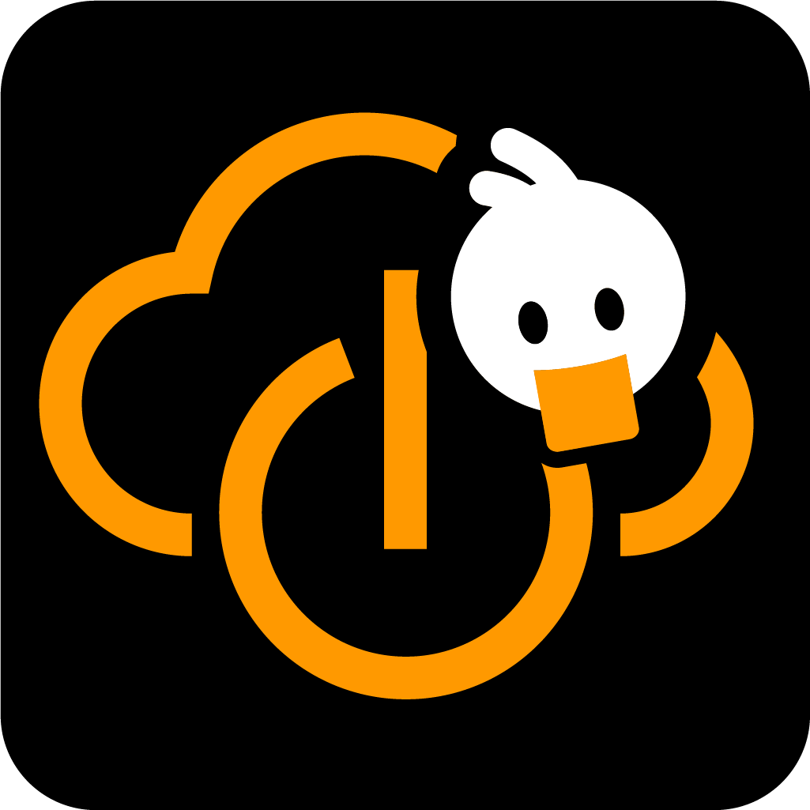

|     |   <h1> Welcome to the  **Cloud Control**   community and documentation </h1> |  
| ---- | ---- |

Thank you for your interest on our Azure Marketplace offering for

* **Cloud Control for Azure AD** - Mobile App for Azure AD PIM Approvements
* **Cloud Control Portal** - Self Service Portal for Azure

Feel free to give us your feedback, make suggestions or let us discuss in our 📢 [discussions tab](../../discussions/).

To report issues or search for existing issues go to the 🔎 [issues tab](../../issues/).

To get the latest news and announcements visit 💥 [Cloud Control - product page](https://whiteduck.de/produkte/cloud-control/).

Tips or Best Practices are tagged with the 🏷 ["Tip" label](../../discussions?discussions_q=label%3Atip).

# Documentation

Will be added shortly...

# Code of conduct

This project adopts the [GitHub Community Code of Conduct](https://docs.github.com/en/site-policy/github-terms/github-community-code-of-conduct).  
